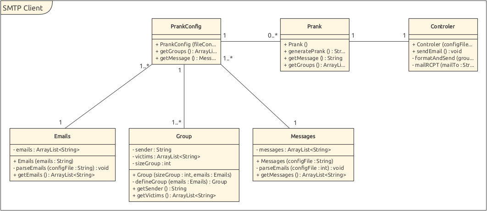

# SMTP-Prank

## Description
Ce projet est un laboratoire pour le cours de API de l'HEIG-VD. Le but de ce projet est d'envoyer des messages (choisis aléatoirement parmi une liste) par mail à des groupes de personnes (les mails sont choisis aléatoirement également parmi une liste). L'envoyeur est choisi parmi la liste de mail, également aléatoirement.

## Installation et implementation d'un serveur SMTP de test

L'installation d'un serveur SMTP en local permet de faire des tests sans envoyer les mails à d'autres personnes. Cela permet également de voir le contenu du mail généré.
Pour effectuer nos tests de fonctionnements nous avons utilisé MockMock.

Lien : https://github.com/tweakers/MockMock

Cette application fournit une interface web supplémentaire qui permet de simuler une boîte de réception, accessible sur http://localhost:8282. Il est possible de choisir les ports que l'on souhaite utilisé pour l'interface web et pour le serveur SMTP. Par défaut le serveur STMP utilise le port 25, mais certains OS peuvent empêcher le lancement du serveur sur ce port si l'application n'est pas exécuté par un utilisateur administrateur. 

## Création d'image docker et lancement du container

Dans ce laboratoire, nous utiliserons un container docker pour faire tourner ce serveur. Le fichier dockerfile et le fichier .one-jar.jar pour faire lancer MockMock (récupérer dans le github ci-dessus) se trouvent dans le dossier docker, à la racine du git. Pour créer notre image docker, nous avons utiliser la commande suivante : 
Docker build –-tag seemt/mockmock

Nous avons donc maintenant une image appelée seemt/mockmock.

Afin de lancer le container qui fera tourner le serveur mockmock, nous avons utilisé la commande suivante :
Docker run -p 25:25 -p 8282:8282 seemt/mockmock

Elle permet de connecter le port 25 du container au port 25 de la machine physique, et le port 8282 du container au port 8282 de la machine physique. Nous avons choisi ces ports pour ne pas voir qu'on travaillait sur un docker, et que le fonctionnement de mockmock soit identique à si on l'avait lancé directement en ligne de commande.

## Configuration de l'outils de génération de prank
Pour utiliser cette application, il faut commencer par clone le repository. Ensuite il est possible de modifier les 3 fichiers suivants afin de renseigner les programmes sur quelques informations nécessaire. Si les fichiers ne sont pas modifiés, l'application fonctionnera et enverra des messages sur des addresses non existantes et sur le serveur SMTP mock.
A la base du git se trouve le dossier "config". Il contient les trois différents fichiers de configuration du programme.
### Config.properties 
- smtp.serverAddress : Permet de configurer l'addresse du serveur SMTP. 
- smtp.serverPort : Permet de configurer le port d'écoute du serveur STMP.
- size.group : Permet de définir le nombre de groupe de personne que l'on veut créer.
- size.sizeGroup : Permet de définir la taille des groupes de personnes. 
- files.email : Définit le fichier contenant la liste des emails du prank
- files.message : Définit le fichier contenant la liste des messages du prank
- witnessToCc : permet d'ajouter une addresse en copie aux mails envoyés. Si witnessToCc=0, cela signifie qu'il n'y a pas de sujet au mail.
- subject : permet de mettre un sujet au mail envoyé. Si subject=0, cela signifie qu'il n'y a pas de sujet au mail.
### Message.config
Ce fichier permet de définir le contenu de différents messages qui peuvent être envoyés par l'application. Les messages contiennent un sujet, sont débutées par "M3SSAG3" sont terminés par "3ND". Nous avons choisi ces balise avec des 3 à la place des E afin de diminuer les risque de croiser ces balise ailleurs dans les messages.
### Email.config
Ce fichier contient la liste de toutes les addresses mails qui seront utilisées par l'application. Les addresses sont séparées par un retour à la ligne. Il contient actuellement une liste de 39 adresses inventées pour ce laboratoire. Ces adresses n'existent donc pas. La ligne 3ND indique la fin de la liste des mails. Ce signe ne doit pas être retiré.

## Implementation

L'application contient 1 package avec plusieurs fichiers gérant le prank. Il contient les fichiers suivants :

- Emails/Messages/Group : Fournis via 3 classes les méthodes permettant de "set" et "get" des attributs aux messages, aux persones et aux groupes. Ces fichiers récupèrent les données via les fichiers de configuration et il permet de représenter les 3 différentes entitées cités juste aux dessus.
- PrankConfig : Va gérer les 3 classes ci-dessus et configurer entièrement le prank pour avoir toutes les données à disposition.
- Prank : Permet de récupérer le contenu d'un message ainsi que la personne qui l'envoie et ceux qui vont le recevoir.

L'application contient également un controleur qui permet de gérer toute la connexion avec le serveur STMP. Il permet d'envoyer les emails aux victimes, de gérer les erreurs de communication avec le serveur smtp. Il affiche également tous les message reçu et envoyé au et par le serveur. En cas d'erreur durant la communication avec le serveur SMTP (message de retour différent de celui attendu), une RuntimeException avec une description de l'erreur est lancée, puis catch. Dans le catch, on indique au serveur que l'on interrompt l'envoi de mail à l'aide de la commande RSET, puis on quitte la communication. Cela permet de continuer d'essayer d'envoyer des mails aux autre groupes, même si un groupe ne peut pas être traité (par exemple, si un mail sur l'ensemble des mails ne contient pas de @ mais un 2 à la place, seul le groupe contenant cet email ne sera pas envoyé). 

### Exemple de discussion avec le serveur SMTP

C: Connection à localhost sur le port 25
S: 220 1aa79758c949 ESMTP MockMock SMTP Server version 1.4
C: EHLO bonjour
S: 250-1aa79758c949
S: 250-8BITMIME
S: 250 Ok
C: MAIL FROM: 17test@test.com
S: 250 Ok
C: RCPT TO: 4test@test.com
S: 250 Ok
C: RCPT TO: 13test@test.com
S: 250 Ok
C: RCPT TO: 34test@test.com
S: 250 Ok
C: RCPT TO: 22test@test.com
S: 250 Ok
C: RCPT TO: JeVeuxVoir@curieux.com
S: 250 Ok
C: DATA
S: 354 End data with <CR><LF>.<CR><LF>
C: From: 17test@test.com
C: To: 4test@test.com, 13test@test.com, 34test@test.com, 22test@test.com
C: Cc: JeVeuxVoir@curieux.com
C: Subject: Sujet important 
C: <CR><LF>
Message envoyé par le client 
C:<CR><LF>.<CR><LF>
S: 250 Ok
C: QUIT
S: 221 Bye
